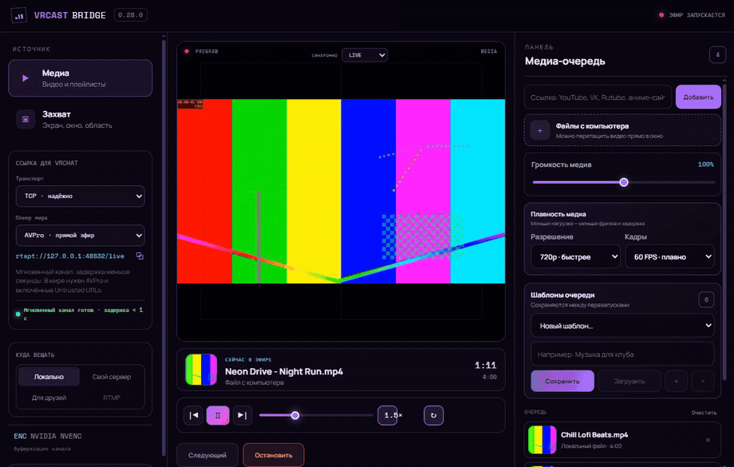
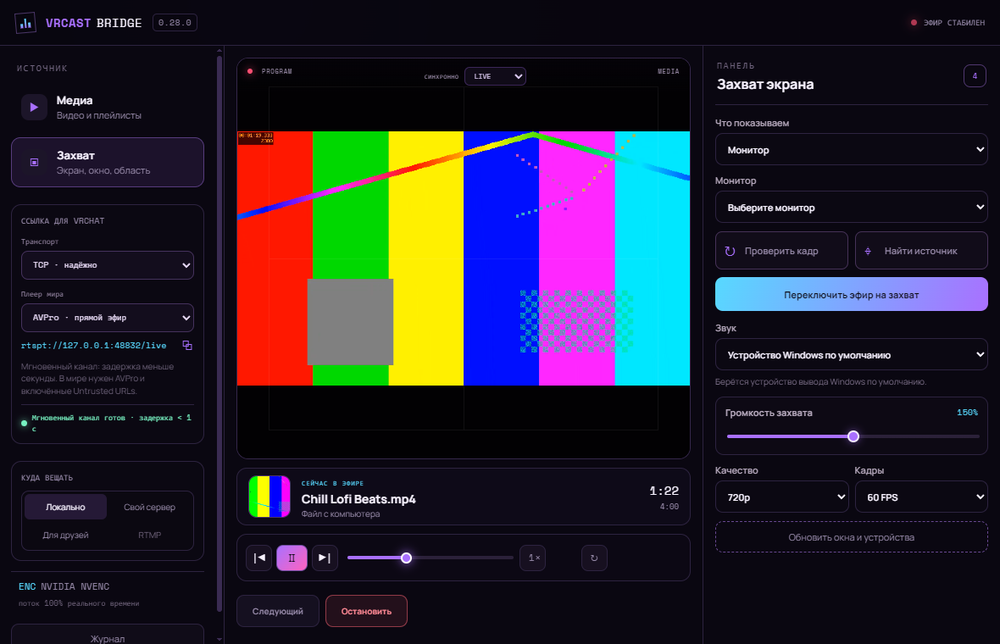
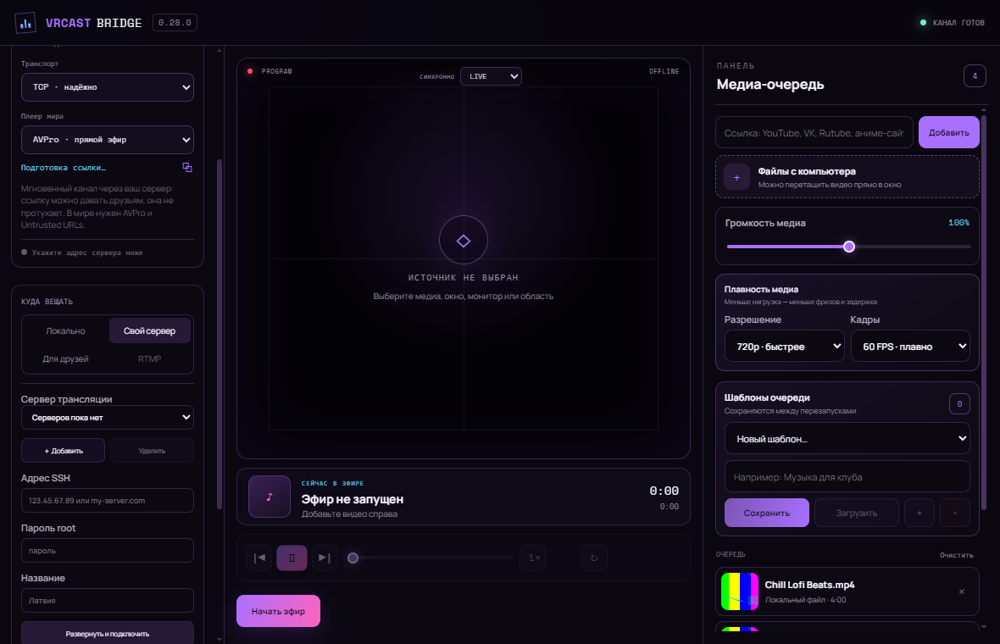

<div align="center">


# VRCast Bridge

Экран, окно, видео или плейлист — одной ссылкой в видеоплеер VRChat.

[](https://github.com/Kevanko/VRCast-Bridge/releases/latest)
[](LICENSE)




</div>

## Что делает

Берёт то, что происходит у вас на компьютере, и отдаёт одной ссылкой для видеоплеера в мире VRChat. Ссылка не меняется, пока программа открыта: можно переключать видео, ставить паузу, переходить с плейлиста на захват экрана — плеер в мире продолжает играть, resync жать не нужно.

Задержка от действия до картинки в VRChat — около полусекунды. Обычные способы через HLS дают три и больше.

## Возможности

**Медиа-очередь.** YouTube и плейлисты, VK, Rutube, аниме-сайты, прямые ссылки на `.mp4` и `.m3u8`. Пауза, перемотка, скорость, повтор. Вся очередь заранее скачивается на диск, поэтому переключение мгновенное.

**Захват.** Монитор, отдельное окно, произвольная область или все мониторы сразу. Окно захватывается через Windows Graphics Capture, поэтому чужие окна поверх него в кадр не попадают.

**Звук.** Системный, конкретного приложения, отдельного выхода или микрофон. Приложение можно приглушить в своих наушниках, оставив полную громкость в эфире — помогает, когда слышишь звук дважды: свой напрямую и его же с задержкой из VRChat.

**Для друзей.** Бесплатный туннель без регистрации. Если есть VPS с белым IP, программа развернёт на нём медиасервер сама — по SSH, за минуту.

**Автообновление.** Новые версии программа находит и ставит сама.

## Установка

Скачайте [VRCast Bridge.exe](https://github.com/Kevanko/VRCast-Bridge/releases/latest) и запустите — это вся программа, установщик не нужен.

Дополнительно нужны [Node.js 20+](https://nodejs.org), [FFmpeg](https://www.gyan.dev/ffmpeg/builds/) в `PATH` и [WebView2](https://developer.microsoft.com/microsoft-edge/webview2/). Загрузчик видео и медиасервер уже внутри файла.

## Как пользоваться

1. Добавьте ссылку или файлы — либо выберите «Захват» и источник на экране.
2. Нажмите «Начать эфир».
3. Скопируйте ссылку сверху и вставьте в AVPro-плеер в мире.

В мире нужен **AVPro** и включённые **Untrusted URLs** — эта настройка задаётся отдельно для каждого аккаунта VRChat.

Все режимы подробно описаны в [руководстве](docs/GUIDE.md).

## Как выглядит

<table>
<tr>
<td width="50%"><br><sub>Захват: монитор, окно, область</sub></td>
<td width="50%"><br><sub>Свой сервер разворачивается по SSH</sub></td>
</tr>
</table>

## Устройство

```
источник (экран или видео) → ffmpeg ┬→ RTSP-сервер → ссылка для VRChat
                                    └→ HLS-релей   → запасная ссылка и предпросмотр
```

Видео кодируется один раз и расходится в два канала. Формат кадра закреплён за сеансом эфира, поэтому смена источника не заставляет плеер переинициализировать декодер — из-за этого раньше и приходилось жать resync.

Ядро — Node.js без внешних зависимостей в рантайме. Оболочка — WinForms и WebView2. Захват звука — компонент на C# с NAudio, захват окон — на Rust через Windows Graphics Capture.

## Сборка

```powershell
git clone https://github.com/Kevanko/VRCast-Bridge.git
cd VRCast-Bridge
npm install
powershell -ExecutionPolicy Bypass -File tools/fetch-tools.ps1

dotnet publish audio-helper/VRCast.AudioCapture.csproj -c Release -o audio-helper/bin/publish
copy audio-helper\bin\publish\VRCast.AudioCapture.exe tools\
cargo build --release --manifest-path capture-helper/Cargo.toml
copy capture-helper\target\release\vrcast-window-capture.exe tools\VRCast.WindowCapture.exe

dotnet publish launcher/VRCastBridge.Launcher.csproj -c Release -o launcher/bin/publish
powershell -ExecutionPolicy Bypass -File tools/sign.ps1
```

`npm test` — шестнадцать интеграционных проверок: поднимают настоящий сервер и гоняют через него реальный поток.

## Лицензия

[MIT](LICENSE). Встроенные сторонние компоненты — под своими лицензиями, они перечислены там же.
