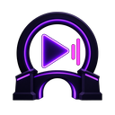

<div align="center">



# VRCast Bridge

**Экран, окно, видео или плейлист — одной ссылкой в видеоплеер VRChat.**
Задержка около полусекунды, а не десяти.

[](https://github.com/Kevanko/VRCast-Bridge/releases/latest)
[](LICENSE)
[](https://github.com/Kevanko/VRCast-Bridge/releases/latest)

</div>

---

## Что это

Программа для Windows, которая превращает **что угодно на вашем компьютере** в поток для видеоплеера VRChat. Запустили, скопировали ссылку, вставили в плеер в мире — друзья видят то же, что и вы.

Ссылка **одна и не меняется**: переключайте видео, ставьте паузу, переходите с плейлиста на захват экрана — плеер в VRChat продолжает играть, resync жать не нужно.

## Возможности

| | |
|---|---|
| 🎬 **Медиа-очередь** | YouTube и плейлисты, VK, Rutube, аниме-сайты, прямые ссылки на `.mp4` и `.m3u8`. Пауза, перемотка, скорость, повтор |
| 🖥️ **Захват** | Монитор, отдельное окно, произвольная область, все мониторы сразу |
| 🔊 **Звук** | Всё системное, конкретное приложение, отдельный выход или микрофон |
| ⚡ **Задержка ~0,5 с** | Встроенный RTSP-сервер вместо медленного HLS |
| 🌍 **Для друзей** | Бесплатный туннель без регистрации — или свой сервер в один клик |
| 🔄 **Автообновление** | Новая версия ставится сама, из окна программы |

## Установка

1. Скачайте **[VRCast Bridge.exe](https://github.com/Kevanko/VRCast-Bridge/releases/latest)** — это и есть вся программа, установщик не нужен.
2. Поставьте, если ещё нет: [Node.js 20+](https://nodejs.org), [FFmpeg](https://www.gyan.dev/ffmpeg/builds/) (в `PATH`) и [WebView2](https://developer.microsoft.com/microsoft-edge/webview2/).
3. Запустите. Всё остальное — интерфейс, медиасервер, загрузчик видео — уже внутри файла.

Обновления программа проверяет сама и ставит по кнопке в шапке.

## Как пользоваться

1. Добавьте ссылку или файлы — либо выберите «Захват» и источник на экране.
2. Нажмите **«Начать эфир»**.
3. Скопируйте ссылку сверху и вставьте в AVPro-плеер в мире VRChat.

В мире должен быть включён **AVPro** и разрешены **Untrusted URLs** (настройка включается отдельно для каждого аккаунта).

Подробное руководство со всеми режимами — **[docs/GUIDE.md](docs/GUIDE.md)**.

## Свой сервер для друзей

Режим «Для друзей» работает сразу, без настройки, через бесплатный туннель — но с задержкой около трёх секунд.

Если есть любой VPS с белым IP, программа развернёт на нём медиасервер **сама**: вводите адрес SSH и пароль root, нажимаете «Развернуть и подключить». Через минуту у друзей мгновенная ссылка, которая не протухает.

Пароль нужен только на время установки и нигде не сохраняется. Кнопка «Удалить» так же аккуратно убирает с сервера всё, что программа туда поставила.

## Как это устроено

```
источник (экран/видео)  →  ffmpeg  →  ┌─ RTSP-сервер  →  ссылка для VRChat (~0,5 с)
                                      └─ HLS-релей    →  запасная ссылка и предпросмотр
```

Видео кодируется **один раз** и расходится в два канала. Формат кадра закреплён за сеансом эфира, поэтому смена источника не заставляет плеер переинициализировать декодер.

Ядро — Node.js без единой внешней зависимости в рантайме. Оболочка — WinForms + WebView2. Захват звука — отдельный компонент на C#/NAudio, захват окон — на Rust через Windows Graphics Capture.

## Сборка из исходников

```powershell
git clone https://github.com/Kevanko/VRCast-Bridge.git
cd VRCast-Bridge
npm install

# сторонние компоненты (yt-dlp, MediaMTX, plink, cloudflared)
powershell -ExecutionPolicy Bypass -File tools/fetch-tools.ps1

# свои компоненты
dotnet publish audio-helper/VRCast.AudioCapture.csproj -c Release -o audio-helper/bin/publish
copy audio-helper\bin\publish\VRCast.AudioCapture.exe tools\
cargo build --release --manifest-path capture-helper/Cargo.toml
copy capture-helper\target\release\vrcast-window-capture.exe tools\VRCast.WindowCapture.exe

# сборка и подпись
dotnet publish launcher/VRCastBridge.Launcher.csproj -c Release -o launcher/bin/publish
powershell -ExecutionPolicy Bypass -File tools/sign.ps1
```

Тесты: `npm test` — 16 интеграционных проверок, поднимают настоящий сервер и гоняют через него реальный поток.

## Лицензия

[MIT](LICENSE). Встроенные сторонние компоненты — под своими лицензиями, они перечислены там же.
