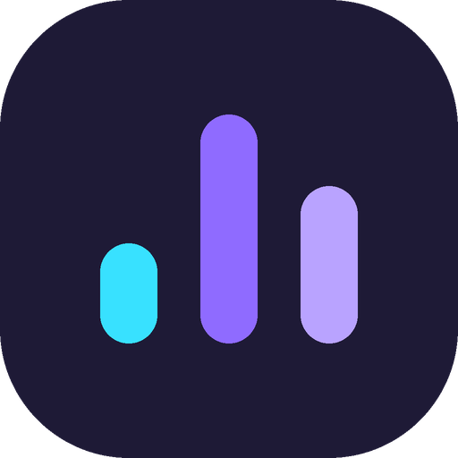
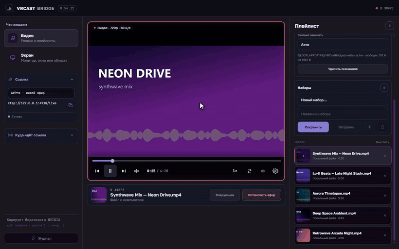
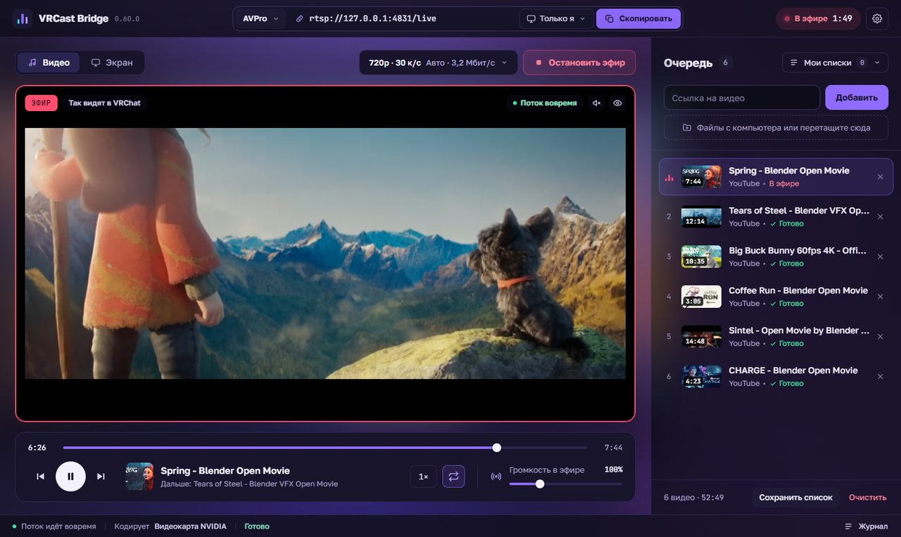
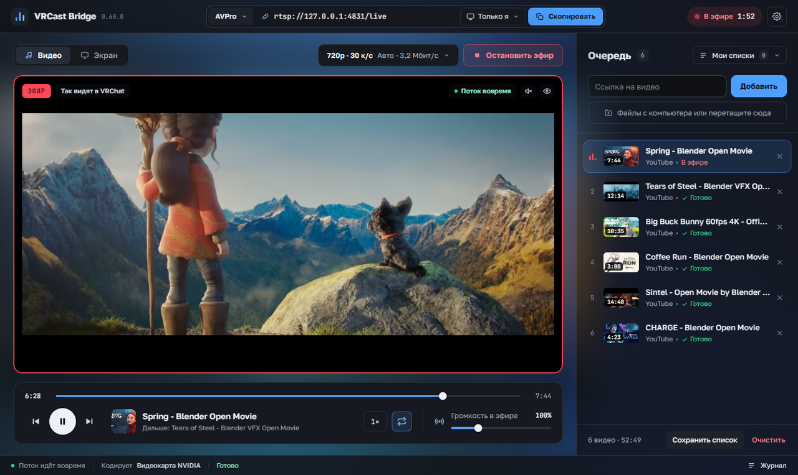
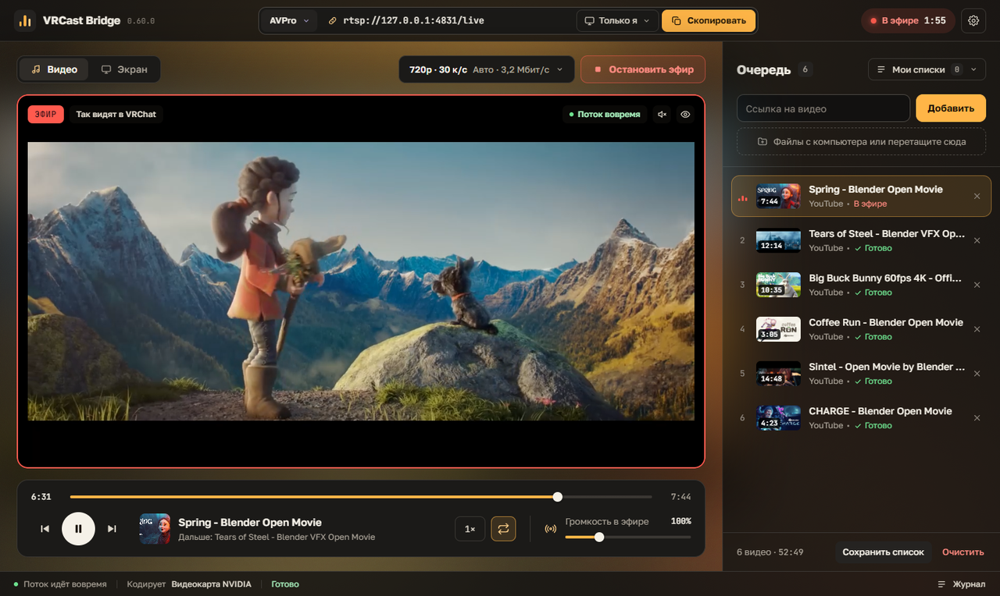

<div align="center">



# VRCast Bridge

Экран, окно, видео или плейлист — одной ссылкой в видеоплеер VRChat.

[](https://github.com/Kevanko/VRCast-Bridge/releases/latest)
[](LICENSE)




</div>

## Что делает

Берёт то, что происходит у вас на компьютере, и отдаёт одной ссылкой для видеоплеера в мире VRChat. Ссылка не меняется, пока программа открыта: можно переключать видео, ставить паузу, переходить с плейлиста на захват экрана — плеер в мире продолжает играть, resync жать не нужно.

Задержка от действия до картинки в VRChat — около полусекунды. Обычные способы через HLS дают три и больше.

## Возможности

**Медиа-очередь.** YouTube и плейлисты, VK, Rutube, прямые ссылки на `.mp4` и `.m3u8`, файлы с компьютера. Ролики перетаскиваются мышью, у каждого на превью видна длительность. Пауза, перемотка, скорость, повтор, сохранённые списки. Нескачанный ролик включается сразу из сети, а на диск докачивается фоном — следующие переключения идут мгновенно. Большой плейлист программа сначала предложит подтвердить.

**Аниме.** AnimeLib и сайты с плеером Kodik: вставьте ссылку — откроется окно, где выбираются серия, одна или весь сезон, озвучка и качество. Длительность серий видна сразу, скачиваются только ближайшие.

**Захват.** Монитор, отдельное окно, произвольная область или все мониторы сразу. Окно захватывается через Windows Graphics Capture, поэтому чужие окна поверх него в кадр не попадают.

**Одна ссылка на всё.** Эфир переключается с плейлиста на захват экрана и обратно одной кнопкой — плеер в мире не переподключается.

**Звук.** Системный, конкретного приложения, отдельного выхода или микрофон. Приложение можно приглушить в своих наушниках, оставив полную громкость в эфире — помогает, когда слышишь звук дважды: свой напрямую и его же с задержкой из VRChat.

**Для друзей.** Бесплатная быстрая ссылка без регистрации — Cloudflare, Serveo или localhost.run. Программа меряет скорость каждого сервиса и в «Авто» берёт самый быстрый. Если есть VPS с белым IP, она развернёт на нём медиасервер сама — по SSH, за минуту.

**Мимо VPN.** Если включён VPN, поток до своего сервера и быстрые ссылки можно пустить напрямую через выбранную сетевую карту — остальной компьютер остаётся за VPN.

**Не мешает игре.** На простое программа почти не нагружает процессор. Процессы эфира идут с повышенным приоритетом, поэтому игра и браузер их не вытесняют, а фоновые загрузки — с пониженным. Если машина не тянет выбранное качество, программа сама снижает нагрузку и следит, чтобы задержка не росла.

**Настройки в одном окне.** Шестерёнка сверху: три темы оформления («Ночной мир», «Эфирная», «Проектор»), кодировщик, способ быстрой ссылки, папка и объём скачанных видео.

**Живой фон.** Мягкий перелив цветов темы дышит в такт музыке эфира, а вокруг плеера разливается свет от самой картинки. Отключается в «Оформлении».

**Работает из трея.** Крестик прячет окно, эфир продолжается; значок в трее открывает программу или останавливает эфир. Можно переключить, чтобы крестик закрывал программу.

**Автообновление.** Программа сама находит новую версию и ставит её по кнопке «Обновить».

## Установка

Скачайте [VRCast Bridge.exe](https://github.com/Kevanko/VRCast-Bridge/releases/latest) и запустите — программа сама предложит папку и ярлык.

Всё недостающее — Node.js, FFmpeg, загрузчик видео, медиасервер и WebView2 — она докачает при первом запуске. Ставить руками ничего не нужно.

## Linux

Запуск из исходников (нужны Node.js 20+ и `ffmpeg`; `yt-dlp`, MediaMTX и cloudflared программа докачает сама или возьмёт из `PATH`):

```bash
git clone https://github.com/Kevanko/VRCast-Bridge.git && cd VRCast-Bridge
npm ci && ./start.sh
```

Откройте `http://127.0.0.1:4717`. Данные лежат в `$XDG_DATA_HOME/VRCastBridge` (по умолчанию `~/.local/share/VRCastBridge`).

| Что | Как работает в Linux |
|---|---|
| Экран, монитор, область, окно | X11 через `x11grab`; список мониторов — `xrandr`, окон — `xprop` и `xwininfo`. В Wayland захват идёт через XWayland и видит только X11-окна |
| Звук | PulseAudio / PipeWire (`pw-dump` или `pactl`): системный звук, выбранный выход или микрофон. Звук одного приложения не вырезается — берётся весь системный |
| Автообновление, захват окна через Windows Graphics Capture, регулировка звука приложений | Только Windows |

Если MediaMTX не стартует с ошибкой `inotify: too many open files`, поднимите лимит: `sudo sysctl fs.inotify.max_user_instances=512`.

Тесты: `npm test` (тесты с захватом экрана пропускаются без `DISPLAY`).

## Как пользоваться

1. Добавьте ссылку или файлы — либо откройте «Экран» и выберите монитор, окно или область.
2. Нажмите «Начать эфир».
3. Скопируйте ссылку сверху и вставьте в AVPro-плеер в мире.

В мире нужен **AVPro** и включённые **Untrusted URLs** — эта настройка задаётся отдельно для каждого аккаунта VRChat.

Все режимы подробно описаны в [руководстве](docs/GUIDE.md).

## Свой сервер одной командой

Нужен VPS с белым IP и Linux (Ubuntu, Debian, CentOS — любой с systemd). Зайдите на него по SSH и выполните:

```bash
curl -fsSL https://raw.githubusercontent.com/Kevanko/VRCast-Bridge/main/server/install.sh | sudo bash
```

Через минуту скрипт покажет адрес и ключ. В программе откройте Настройки → Сеть и серверы → «Добавить сервер» → «Уже настроен», вставьте их и сверху выберите «Свой сервер». Ссылка для VRChat — `rtspt://адрес:8554/live`.

Если порт 8554 занят, задайте другой: `curl … | sudo VRCAST_PORT=9554 bash`. Если у хостера есть файрвол в панели, откройте там этот порт по TCP.

На сервере появится команда `vrcast`:

| Команда | Что делает |
|---|---|
| `vrcast status` | работает ли сервер и сколько подключений |
| `sudo vrcast key` | ещё раз показать адрес и ключ |
| `sudo vrcast update` | обновить до последней версии, ключ сохранится |
| `sudo vrcast restart` | перезапустить |
| `vrcast logs` | последние строки журнала |
| `sudo vrcast uninstall` | удалить сервер и закрыть порты |

Можно и без консоли: «Добавить сервер» → «Настроить с нуля» — программа сама зайдёт по SSH с паролем root (пароль не сохраняется).

## Как выглядит

<table>
<tr>
<td width="33%"><br><sub>«Ночной мир»</sub></td>
<td width="33%"><br><sub>«Эфирная»</sub></td>
<td width="33%"><br><sub>«Проектор»</sub></td>
</tr>
</table>

<sub>В кадре — открытые фильмы Blender Studio (CC BY).</sub>

## Устройство

```
источник (экран или видео) → ffmpeg ┬→ RTSP-сервер → ссылка для VRChat
                                    └→ HLS-релей   → запасная ссылка и предпросмотр
```

Видео кодируется один раз и расходится в два канала. Формат кадра закреплён за сеансом эфира, поэтому смена источника не заставляет плеер переинициализировать декодер — из-за этого раньше и приходилось жать resync.

Ядро — Node.js без внешних зависимостей в рантайме. Оболочка — WinForms и WebView2. Захват звука — компонент на C# с NAudio, захват окон — на Rust через Windows Graphics Capture.

## Сборка

```powershell
git clone https://github.com/Kevanko/VRCast-Bridge.git
cd VRCast-Bridge
npm install
powershell -ExecutionPolicy Bypass -File tools/fetch-tools.ps1

dotnet publish audio-helper/VRCast.AudioCapture.csproj -c Release -o audio-helper/bin/publish
copy audio-helper\bin\publish\VRCast.AudioCapture.exe tools\
cargo build --release --manifest-path capture-helper/Cargo.toml
copy capture-helper\target\release\vrcast-window-capture.exe tools\VRCast.WindowCapture.exe

dotnet publish launcher/VRCastBridge.Launcher.csproj -c Release -o launcher/bin/publish
powershell -ExecutionPolicy Bypass -File tools/sign.ps1
```

`npm test` — 45 интеграционных проверок: поднимают настоящий сервер и гоняют через него реальный поток — задержку, стабильность при снижении битрейта, переключение источников, восстановление после сбоев.

## Лицензия

[MIT](LICENSE). Встроенные сторонние компоненты — под своими лицензиями, они перечислены там же.
